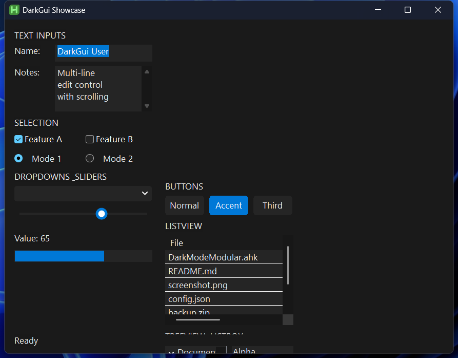
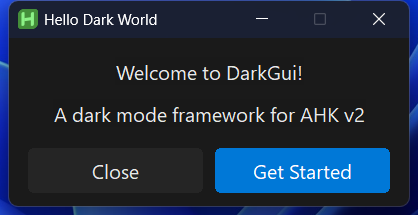
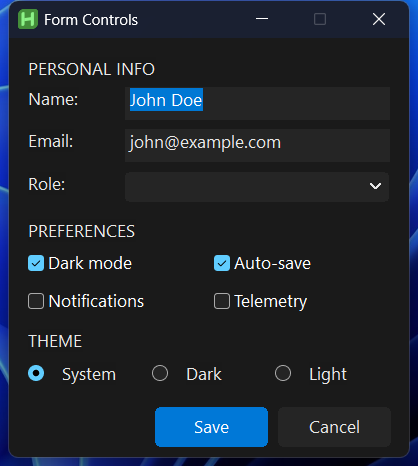
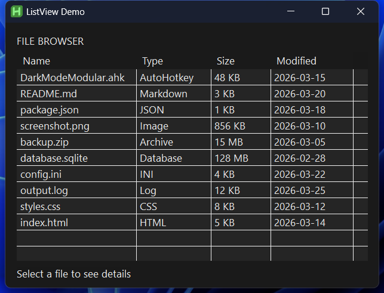
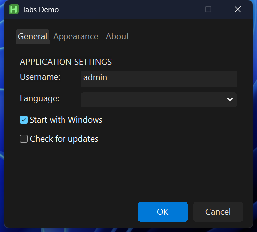
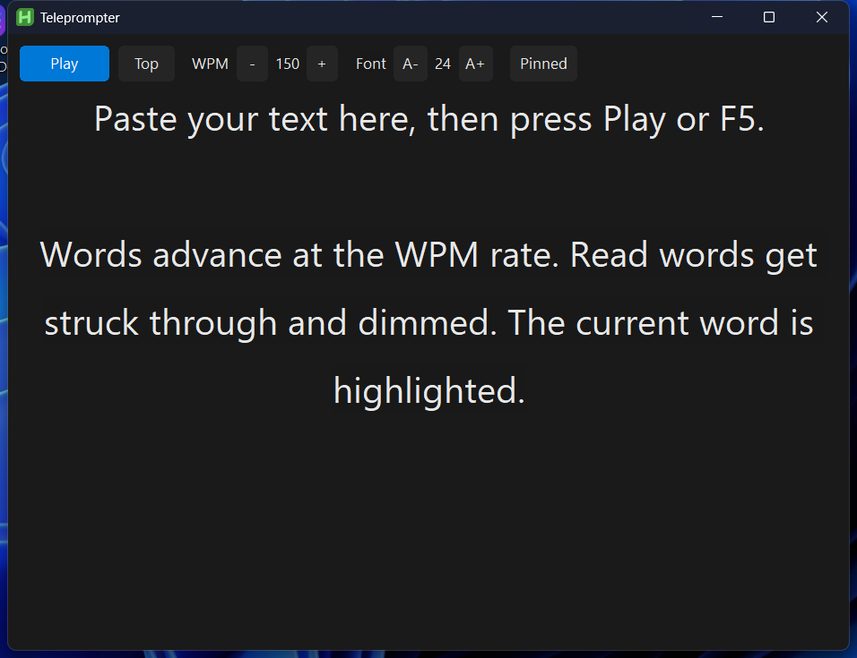
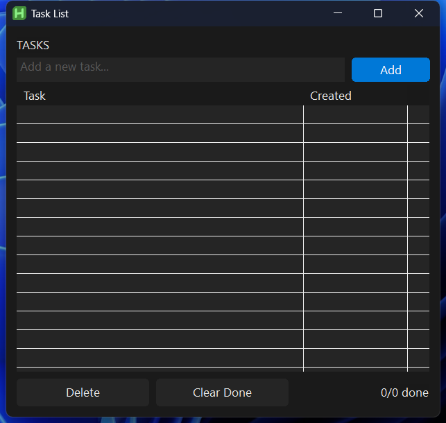

# DarkGui

A dark mode GUI framework for AutoHotkey v2. Drop-in replacement for `Gui()` that automatically dark-styles every control.



## Quick Start

```cpp
#Requires AutoHotkey v2.1-alpha.23
#Include DarkModeModular.ahk

g := DarkGui("+Resize", "My App")
g.Add("Text", "w300", "Hello from DarkGui!")
g.Add("Edit", "w300", "Dark-styled edit control")
g.Add("Button", "+Accent w100", "OK").OnEvent("Click", (*) => MsgBox("Clicked!"))
g.Add("Button", "w100", "Cancel").OnEvent("Click", (*) => ExitApp())
g.Show()
g.OnEvent("Close", (*) => ExitApp())
```

## Requirements

- [AutoHotkey v2.1-alpha.23](https://github.com/AutoHotkey/AutoHotkey/releases) or later
- Windows 10 1809+ (for dark title bar support)

## Features

- **One-line migration** -- replace `Gui()` with `DarkGui()`, all controls are auto-styled
- **Accent buttons** -- add `+Accent` to button options for blue accent color
- **Dark title bar** -- uses DWM `DwmSetWindowAttribute` (Win10 1809+)
- **Dark menus** -- undocumented uxtheme APIs for dark context menus
- **Custom-drawn controls** -- owner-draw buttons, sliders, progress bars, tab controls
- **Dark ListView** -- custom header colors, row hover, hidden scrollbar arrows
- **Dark scrollbar** -- optional `DarkScrollbar` class for ListView scroll sync
- **DPI aware** -- `DarkTheme.Scale()` for DPI-correct pixel values
- **Theme customization** -- `DarkTheme.SetColor()` to override any color
- **GDI resource management** -- automatic brush cleanup on exit

## Supported Controls

| Control | Auto-styled | Notes |
|---------|-------------|-------|
| Text | Yes | Font color auto-applied |
| Edit | Yes | Dark background, white text, border removed |
| Button | Yes | Owner-drawn with hover/press states |
| CheckBox | Yes | DarkMode_Explorer theme |
| Radio | Yes | Custom text label for proper dark styling |
| ComboBox | Yes | Dark dropdown with subclassed list |
| Slider | Yes | GDI+ custom-drawn track and thumb |
| Progress | Yes | Accent-colored fill bar |
| ListView | Yes | Custom-drawn header, rows, hover, grid lines |
| TreeView | Yes | Dark background, text, and line colors |
| ListBox | Yes | Dark background with white text |
| GroupBox | Yes | Owner-drawn border and label |
| Tab3 | Yes | Dark tab headers and background |

## API Reference

### DarkGui

Creates a dark-themed GUI. Same signature as `Gui()`.

```cpp
// Create a dark GUI window
g := DarkGui("+Resize +MinSize400x300", "My Window")

// Add controls -- all auto-styled
g.Add("Button", "+Accent w120 h32", "Save")            // blue accent button
g.Add("Button", "w120 h32", "Cancel")                   // standard dark button
g.Add("Edit", "w300 h80 +Multi", "text")                // dark multi-line edit
g.Add("ListView", "w400 h200 +Grid", ["Name", "Size"])  // dark ListView with grid
g.Add("CheckBox", "w200 +Checked", "Enable feature")    // dark checkbox
g.Add("ComboBox", "w200", ["Option A", "Option B"])      // dark dropdown
g.Add("Slider", "w200 Range0-100", 50)                  // custom-drawn slider
g.Add("Progress", "w200 h20", 75)                       // accent-colored bar
```

### DarkTheme

Static class managing colors and GDI brushes.

```cpp
// Read a color value
bg := DarkTheme.Colors["Background"]    // 0x1A1A1A

// Override a color at runtime
DarkTheme.SetColor("Accent", 0x00AA55)  // green accent instead of blue

// DPI-scale a pixel value
scaled := DarkTheme.Scale(14)           // 14px at 96 DPI, 21px at 144 DPI

// Get a cached GDI brush
brush := DarkTheme.GetBrush("Controls") // HBRUSH for control background

// Convert between RGB and BGR (for Win32 GDI)
bgr := DarkTheme.RGBtoBGR(0xFF0000)    // 0x0000FF
```

**Default color palette:**

| Name | Hex | Used for |
|------|-----|----------|
| `Background` | `0x1A1A1A` | Window background |
| `Controls` | `0x252525` | Control backgrounds |
| `ControlsHover` | `0x333333` | Hover state |
| `ControlsActive` | `0x404040` | Pressed/active state |
| `Font` | `0xE8E8E8` | Primary text |
| `FontDim` | `0xA0A0A0` | Secondary/dim text |
| `Accent` | `0x0078D7` | Accent buttons, selection |
| `Border` | `0x404040` | Control borders |
| `Selection` | `0x264F78` | Selected items |

### Layout

Helper class that eliminates manual pixel positioning. Tracks Y position and calculates control geometry automatically. Include separately.

```cpp
#Include Layout.ahk

winW := 400
lay := Layout(winW, 15, 10)            // winW, margin, gap

g := DarkGui(, "My App")

// Section header -- full width, small spacing
g.Add("Text", lay.Section(), "SETTINGS")

// Label + control on one row
lr := lay.LabelRow(80, 26)
g.Add("Text", lr[1], "Name:")
g.Add("Edit", lr[2], "value")

// Full-width control
g.Add("Edit", lay.Row(60, "+Multi"), "notes here")

// N equal columns (does NOT auto-advance Y)
cols := lay.Columns(2, 22)
g.Add("CheckBox", cols[1], "Option A")
g.Add("CheckBox", cols[2], "Option B")
lay.Advance(22)                         // must call after Columns

// Right-aligned button row (auto-advances Y)
btns := lay.ButtonRow(90, 2, 32)
g.Add("Button", "+Accent " btns[1], "Save")
g.Add("Button", btns[2], "Cancel")

// Window height auto-calculated from layout
g.Show("w" winW " h" lay.CurrentY)
```

**Methods:**

| Method | Advances Y | Returns |
|--------|-----------|---------|
| `Row(h, extra?)` | Yes | Options string |
| `Section(h?)` | Yes | Options string |
| `LabelRow(labelW, h, extra?)` | Yes | `[labelOpts, controlOpts]` |
| `ButtonRow(widths, n, h)` | Yes | Array of options strings |
| `Columns(n, h, extra?)` | No | Array of options strings |
| `Split(leftW, h, extra?)` | No | `[leftOpts, rightOpts]` |
| `RowSized(w, h, align?, extra?)` | Yes | Options string |
| `Advance(h)` | Yes | -- |
| `Space(px?)` | Yes | -- |
| `CurrentY` | -- | Current Y position |
| `Remaining(winH)` | -- | Pixels left to bottom margin |

### DarkTitleBar

Applies dark mode to window title bar using DWM attributes.

```cpp
DarkTitleBar.Apply(myGui.Hwnd)  // called automatically by DarkGui
```

### DarkMenu

Enables dark mode for application menus via undocumented uxtheme ordinals 135/136.

```cpp
DarkMenu.Apply()  // called automatically by DarkGui
```

### DarkScrollbar

Creates a custom dark scrollbar synced to a ListView.

```cpp
scrollbar := DarkScrollbar(myGui, listView, x, y, h)
scrollbar.UpdatePosition(x, y, newH)  // on resize
scrollbar.Destroy()                    // cleanup
```

## Examples

### 01 -- Hello World

Minimal window with text and buttons.



```cpp
#Include DarkModeModular.ahk
#Include Layout.ahk

winW := 320
lay := Layout(winW, 15, 10)
g := DarkGui(, "Hello Dark World")
g.SetFont("s12", "Segoe UI")

g.Add("Text", lay.Row(24, "Center"), "Welcome to DarkGui!")
g.Add("Text", lay.Row(24, "Center cA0A0A0"), "A dark mode framework for AHK v2")

btns := lay.ButtonRow(140, 2, 36)
g.Add("Button", btns[1], "Close")
g.Add("Button", "+Accent " btns[2], "Get Started")

g.Show("w" winW " h" lay.CurrentY)
```

### 02 -- Form Controls

Edit fields, ComboBox, CheckBoxes, Radio buttons.



```cpp
lay := Layout(320, 15, 8)
g := DarkGui(, "Form Controls")

g.Add("Text", lay.Section(), "PERSONAL INFO")
lr := lay.LabelRow(70, 26)
g.Add("Text", lr[1] " cA0A0A0", "Name:")
g.Add("Edit", lr[2], "John Doe")

cols := lay.Columns(2, 22)
g.Add("CheckBox", cols[1] " +Checked", "Dark mode")
g.Add("CheckBox", cols[2] " +Checked", "Auto-save")
lay.Advance(22)
```

### 03 -- ListView

Dark-styled data table with column headers and row selection.



```cpp
g.Add("Text", lay.Section(), "FILE BROWSER")
lv := g.Add("ListView", lay.Row(280, "+Grid"), ["Name", "Type", "Size", "Modified"])
lv.Add("", "DarkModeModular.ahk", "AutoHotkey", "48 KB", "2026-03-15")
lv.ModifyCol(1, 160)
```

### 04 -- Tab Controls

Tab3 with controls organized across multiple tabs.



```cpp
tabs := g.Add("Tab3", Format("x{} y{} w{} h{}", m, m, tabW, tabH),
    ["General", "Appearance", "About"])

tabs.UseTab("General")
g.Add("Text", tabLay.Section(), "APPLICATION SETTINGS")
lr := tabLay.LabelRow(90, 26)
g.Add("Text", lr[1] " cA0A0A0", "Username:")
g.Add("Edit", lr[2], "admin")
```

### 05 -- Full Showcase

All controls in a single window.


## Apps

### Teleprompter

Full-featured teleprompter with RichEdit control, word-by-word highlighting, adjustable WPM, font sizing, and smooth auto-scroll.



- Play/Pause with F5 or button
- Current word highlighted with blue background
- Read words struck through and dimmed
- Ctrl+Up/Down to adjust WPM
- Pin/float always-on-top toggle

### SpellCheck

System spell checker integration via Windows COM `ISpellChecker`. Hotkey-activated popup with suggestions, fix-all, and dictionary management.

- Ctrl+Shift+S to check selected text
- Single-word auto-correct for known replacements
- Multi-error panel with per-word suggestions
- Win+Alt+S to open dictionary manager

### TaskList

Task manager with add/delete/complete, checkbox ListView, and JSON file persistence.



```cpp
// Tasks persist to tasks.json next to the script
this.tasks.Push(Map(
    "text", text,
    "done", false,
    "created", FormatTime(, "yyyy-MM-dd HH:mm")
))
this.SaveTasks()
this.RefreshList()
```

## Project Structure

```
DarkGui/
  DarkModeModular.ahk       // The framework (include this)
  Layout.ahk                // Layout helper (optional)
  examples/
    01_hello.ahk             // Minimal example
    02_form.ahk              // Form controls
    03_listview.ahk          // ListView
    04_tabs.ahk              // Tab controls
    05_showcase.ahk          // All controls
  apps/
    Teleprompter.ahk         // Teleprompter app
    SpellCheck.ahk           // Spell checker
    TaskList.ahk             // Task list manager
  screenshots/               // PNG screenshots
```

## License

MIT
